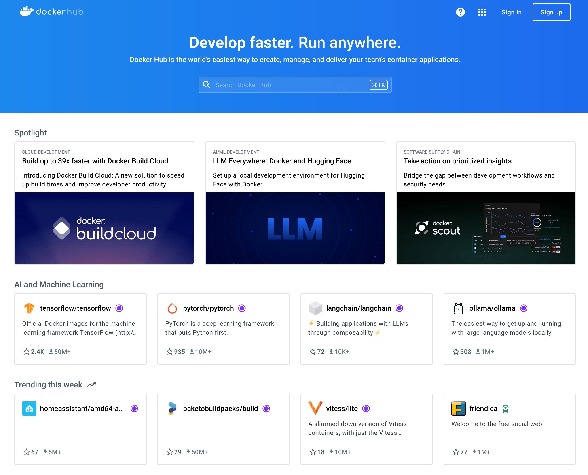

# Introduction to GIT+DOCKER
<div align="center">
  <code></code>
	<code></code>
	<code></code>
	<code></code>
</div>
# PART 01 - Git Basic Guide (Step-by-Step)

Git is a versioning control tools used to manage project and track changes.

## 1. Installing Git

Here's the straight forward guidelines on how to install git on your machine

> https://git-scm.com/book/en/v2/Getting-Started-Installing-Git

Run `git -v`command on Terminal/Poweshell to check Git was properly installed :

```bash
git -v
```

## 2. Register Device using SSH-Key

To manage shared projects that were set to private, you need an SSH-Key setup.

Open `Terminal` for MacOs or `Powershell` on Windows and type

```bash
ssh-keygen -t rsa -C "<whatever-remark>"
```

Copy and Paste the pubkey to your SSH-Key records in github account [here](https://github.com/settings/keys)

_MacOs :_

```bash
cat ~/.ssh/id_rsa.pub
```

_Windows :_

```bash
cat .ssh/id_rsa.pub # - on your User Directory
```

> <b>make sure to run below commands to set user on your workstation : </b><br>
> git config --global user.name "Your Github User" <br>
> git config --global user.email email@ofyourgitlab

From this point, you can clone and manage all private repositories assigned to or shared with you without password

_Note: Other method to access or giving access is to set an __access token___

## 3. Clone a repository

Go to

> https://github.com/nordinr/git-init-basic/

Hit the code button (blue-colored) and copy the clone url (SSH)


```bash {"id":"01JE8WEDR6WKG188FYJ7BBG8S4"}
git clone git@github.com:nordinr/git-init-basic.git
```

Go to your workstation, open terminal on your work directory and type git clone command.
Git clone command :

```bash {"id":"01JE8WX1B5GEAQZFEMY9F279FH"}
git clone git@github.com:nordinr/git-init-basic.git
```

You will find a folder named 'git-init-basic' containing repo files from this github.


## 4. Branch

Branch is a feature that separate repo to a different copies. Some repo owner use branch to separate versions instead. That's depends on your branch strategy. In general, branch were used to make copies of your project and modify them for the next versions.

> master or main branch also called a **stable** branch that contains most stable code of the project.

## 5. Merge and Pull Request

After making a changes on a branch, feature or dev, normal practice is to merge them into main before release. This also called Pull Request.

## 6. Tag and Release

When a project reach some progress point, a good practice is to introduce a tag and release point. Also called version.

Semantic versioning follows the format:<br>

```yaml {"id":"01JE8WEDR6WKG188FYJ7P6EA5H"}
<MAJOR.MINOR.PATCH>

MAJOR: Incremented for breaking changes.
MINOR: Incremented for new features that are backward-compatible.
PATCH: Incremented for backward-compatible bug fixes.

eg: v1.0.1, v1.1.2, v1.2.0-feature-name, v1-stable etc...
```

This basic introduction was made for PITA Projects' Students, UMT

# PART 02 - Docker (very) Basic


For this practice, i assume docker were installed on your workstation

To install docker, go to : https://docs.docker.com/desktop/

## Running Docker Compose File

Here are the compose file name `compose.yaml` that was prepared for you to run. Be free to ask google/chatgpt on what it is all about. Make sure you clone this repo to a directory on your workstation.

```yaml {"id":"01JE8WEDR6WKG188FYJ833G3VQ"}
---
services:
  php83:
    container_name: php83
    image: nordinr/php83-oci8:latest
    ports:
      - 791:80
    restart: always
    volumes:
      - ./php83:/var/www/html
  php82:
    container_name: php82
    image: nordinr/php82-oci8:latest
    ports:
      - 792:80
    restart: always
    volumes:
      - ./php82:/var/www/html
```

To deploy containers in this file, make sure you are in the project folder

```bash {"id":"01JE8WEDR6WKG188FYJB4FKPTS"}
cd git-init-basic       # go inside project folder

docker compose up -d    # run this command to bring up containers

# returned output
[+] Running 2/2
✔ Container php82 Started                                    0.4s 
✔ Container php83  Started                                   0.4s
```

This wil deploy 2 containers.

```bash {"id":"01JE8WEDR6WKG188FYJBC3D7XK"}
docker ps

# returned output
CONTAINER ID   IMAGE                       COMMAND                  CREATED         STATUS         PORTS                 NAMES
8089c54530ef   nordinr/php83-oci8:latest   "docker-php-entrypoi…"   5 seconds ago   Up 4 seconds   0.0.0.0:791->80/tcp   php83
5cd5557f2883   nordinr/php82-oci8:latest   "docker-php-entrypoi…"   5 seconds ago   Up 4 seconds   0.0.0.0:792->80/tcp   php82

```

Now you already deploy 2 containers each that serve different version of phps. If we see the volume mapping part on `compose.yaml`, `php83` and `php82` projects folder were located on its own separate folders.

```yaml {"id":"01JE8WEDR6WKG188FYJBW7555M"}
volumes:
      - ./php83:/var/www/html <--- php83
volumes:
      - ./php82:/var/www/html <--- php82
```

You can place your project files inside those folders and access them with exposed url on localhost, for this case

http://localhost:791 <---php83<br>
http://localhost:792 <---php82

## Docker Registry (Dockerhub)

Explore images that can be use to deploy a container in docker registry : https://hub.docker.com


-END-